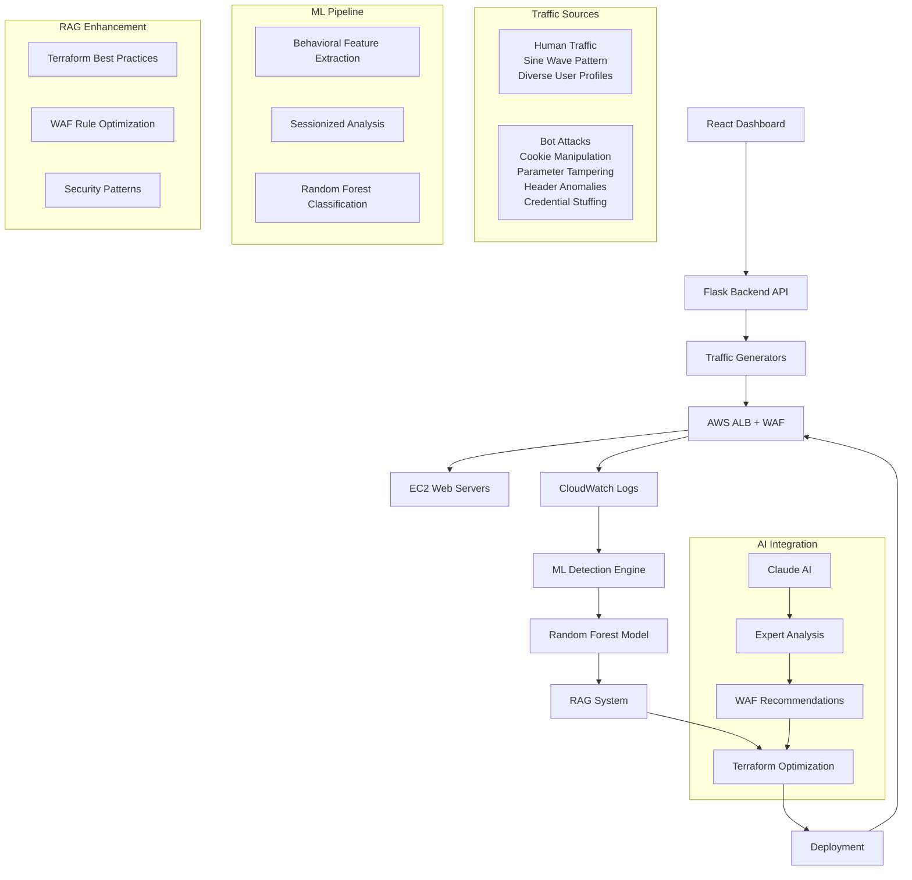

# Advanced Bot Detection & Mitigation Demo

A comprehensive demonstration of ML-powered bot detection with automated WAF rule deployment, featuring a React UI dashboard and RAG-powered Terraform optimization.

## Overview

This system demonstrates:

1. **Traffic Generation**: Realistic human traffic patterns and sophisticated bot attack simulation
2. **ML Detection**: Robust Random Forest analysis using behavioral features for bot identification
3. **React Dashboard**: Interactive UI for monitoring and controlling the entire system
4. **Claude AI Integration**: Expert analysis and recommendations for WAF optimization
5. **Automated Response**: Dynamic WAF rule generation and deployment
6. **RAG Integration**: Terraform best practices optimization using Retrieval-Augmented Generation

## Architecture



## Quick Start

### Prerequisites

- AWS Account with appropriate permissions
- Terraform >= 1.0
- Python 3.8+
- AWS CLI configured
- Node.js 16+ (for React UI)

### 1. Clone and Setup

```bash
git clone <repository>
cd bot-detection-demo

# Install Python dependencies
pip install -r traffic_generator/requirements.txt
pip install -r ml_detection/requirements.txt
pip install -r rag_integration/requirements.txt

# Install React dependencies
cd bot-detection-ui
npm install
cd ..
```

### 2. Deploy Infrastructure

```bash
# Initialize and deploy AWS infrastructure
cd terraform
terraform init
terraform plan
terraform apply

# Note the ALB DNS name from outputs
```

### 3. Start the React Dashboard

```bash
# Start the Flask backend API
cd bot-detection-ui
python backend_api.py

# In another terminal, start the React frontend
npm start
```

### 4. Run Traffic Generation

```bash
# Generate human traffic
python traffic_generator/human_traffic.py \
  --target-url http://your-alb-dns.com \
  --users 15 \
  --frequency 0.8 \
  --amplitude 0.4 \
  --duration 1800

# Generate bot attacks
python traffic_generator/bot_attack.py \
  --target-url http://your-alb-dns.com \
  --attack-type cookie_manipulation \
  --rate 8.0 \
  --duration 300
```

## Components Deep Dive

### Traffic Generation

#### Human Traffic (`traffic_generator/human_traffic.py`)
- **Sine Wave Pattern**: Realistic traffic volume fluctuations using mathematical sine waves
- **Behavioral Simulation**: Proper session management, referer chains, realistic timing
- **Browser Diversity**: Multiple user agents, varied request patterns, mobile/desktop simulation
- **Session Persistence**: Cookies, session IDs, user preferences, realistic session management
- **Geographic Diversity**: Multiple IP ranges simulating different regions and ISPs

```python
# Example: Start human traffic
python traffic_generator/human_traffic.py \
  --target-url http://your-alb-dns.com \
  --users 15 \
  --frequency 0.8 \
  --amplitude 0.4 \
  --duration 1800
```

#### Bot Attacks (`traffic_generator/bot_attack.py`)
- **Cookie Manipulation**: Suspicious cookie patterns, injection attempts, session hijacking
- **Parameter Tampering**: SQL injection, XSS, path traversal, command injection
- **Header Anomalies**: Suspicious headers, automation indicators, bot signatures
- **Credential Stuffing**: Login attempts with common credentials
- **DDoS Simulation**: High-frequency requests from single IP
- **Evasion Techniques**: Human-like headers with subtle flaws, IP spoofing

```python
# Example: Start bot attack
python traffic_generator/bot_attack.py \
  --target-url http://your-alb-dns.com \
  --attack-type cookie_manipulation \
  --rate 8.0 \
  --duration 300
```

### ML Detection Engine

#### Bot Detection (`ml_detection/bot_detector.py`)
- **Random Forest Classifier**: Ensemble learning for robust detection
- **Behavioral Features**: Session-based analysis, no label leakage
- **Feature Importance**: Identifies key indicators for rule generation
- **Decision Tree Analysis**: Extracts interpretable rules
- **Confidence Scoring**: Provides prediction confidence levels
- **Production-Ready**: Calibrated probabilities, business-relevant metrics

#### Feature Categories
- **IP Features**: Request frequency, timing patterns, geographic indicators
- **Request Features**: User-agent analysis, parameter inspection, header anomalies
- **Temporal Features**: Time-based patterns, business hours analysis
- **Behavioral Features**: Navigation patterns, session analysis, error rates
- **Derived Features**: Automation scores, anomaly detection, risk assessment

### Claude AI Integration (`bot-detection-ui/src/components/ClaudeAnalysis.js`)

The system integrates Claude AI for expert analysis and recommendations:

- **ML Model Analysis**: Sends training data to Claude for deep insights
- **WAF Rule Optimization**: AI-powered recommendations for rule improvements
- **Expert Recommendations**: Professional security analysis and best practices
- **Terraform Generation**: Claude generates optimized Terraform configurations

#### Claude Analysis Features
- **Model Performance Review**: Accuracy, feature importance, training metrics
- **Decision Logic Analysis**: Understanding of bot detection patterns
- **WAF Rule Validation**: Performance analysis of deployed rules
- **Production Recommendations**: Expert guidance for production deployment

#### Claude Integration Workflow
1. **Data Export**: ML training results sent to Claude API
2. **Expert Analysis**: Claude analyzes model performance and WAF rules
3. **Recommendations**: AI-generated suggestions for improvements
4. **Terraform Generation**: Claude creates optimized infrastructure code

```javascript
// Example: Request Claude analysis
const response = await fetch('/api/ml/claude-analysis', {
  method: 'POST',
  headers: { 'Content-Type': 'application/json' }
});

// Claude provides expert analysis of:
// - Model accuracy and feature importance
// - WAF rule effectiveness and false positive rates
// - Production deployment recommendations
// - Optimized Terraform configurations
```

### React Dashboard (`bot-detection-ui/`)

#### Backend API (`backend_api.py`)
- **Flask API**: RESTful endpoints for traffic control and ML management
- **Traffic Management**: Start/stop human and bot traffic generation
- **ML Integration**: Model training and metrics retrieval
- **WAF Management**: Rule deployment and testing
- **Real-time Monitoring**: Live metrics and status updates

#### Traffic Controller (`traffic_controller.py`)
- **WAF Log Processing**: S3-based log analysis and feature extraction
- **ML Model Integration**: Real-time bot detection and rule generation
- **Terraform**: Direct WAF rule deployment
- **RAG Storage**: Persistent knowledge base management

#### React Components
- **ControlPanel**: Traffic generation controls and system management
- **TrafficDashboard**: Real-time traffic visualization
- **MLModelVisualizer**: Model performance and feature importance
- **WAFRulesPanel**: Rule management and deployment
- **LiveLogStream**: Real-time log monitoring
- **MetricsCharts**: Performance metrics and analytics
- **ClaudeAnalysis**: AI-powered expert analysis and recommendations

### RAG Integration (`rag_integration/terraform_rag.py`)

The RAG system enhances Terraform generation with:

- **Knowledge Base**: Curated best practices for Terraform and AWS WAF
- **Semantic Search**: Vector-based retrieval using Sentence Transformers
- **Context-Aware Optimization**: Tailored recommendations based on detected threats
- **Code Generation**: Optimized Terraform with best practices applied
- **ChromaDB Storage**: Persistent vector database for knowledge retrieval

#### Knowledge Categories
- **Best Practices**: State management, module design, testing
- **Security**: IAM policies, encryption, validation
- **WAF Optimization**: Rule ordering, performance tuning
- **Performance**: Cost optimization, rule efficiency

### Terraform Infrastructure (`terraform/`)

#### Core Components
- **VPC & Networking**: Multi-AZ setup with proper routing
- **Application Load Balancer**: With access logging to S3
- **AWS WAF**: Comprehensive rule set with logging
- **Auto Scaling**: EC2 instances with health checks
- **Monitoring**: CloudWatch dashboards and alarms

#### WAF Configuration (`waf.tf`)
- **Rate Limiting**: Baseline protection with X-Forwarded-For support
- **Managed Rules**: AWS Core Rule Set and Known Bad Inputs
- **Dynamic Rules**: ML-generated blocking rules
- **Logging**: CloudWatch integration for monitoring

#### Dynamic Rule Deployment
Rules are automatically generated and deployed via AWS CLI:

```bash
# Example generated rule deployment
aws wafv2 update-web-acl \
  --name "bot-detection-demo-waf-v2" \
  --scope REGIONAL \
  --default-action Allow={} \
  --rules file://generated_rules.json
```

## Configuration

### Environment Variables

```bash
# AWS Configuration
export AWS_REGION=us-east-1
export AWS_PROFILE=your-profile

# Demo Configuration
export DEMO_DURATION=45  # minutes
export HUMAN_USERS=15
export ATTACK_RATE=8.0
```

### Terraform Variables (`terraform/variables.tf`)

```hcl
variable "aws_region" {
  description = "AWS region"
  type        = string
  default     = "us-east-1"
}

variable "project_name" {
  description = "Project name for resource naming"
  type        = string
  default     = "bot-detection-demo"
}
```

### ML Model Configuration

```python
# In ml_detection/bot_detector.py
model = RandomForestClassifier(
    n_estimators=100,
    max_depth=10,
    min_samples_split=5,
    class_weight='balanced'
)
```

## Monitoring & Analysis

### React Dashboard Metrics
- **Real-time Traffic**: Live visualization of human vs bot traffic
- **ML Performance**: Model accuracy, feature importance, training metrics
- **WAF Activity**: Rule effectiveness, blocked requests, false positives
- **System Status**: Infrastructure health, API endpoints, process status

### CloudWatch Metrics
- WAF request counts (allowed/blocked)
- Rule-specific metrics
- Error rates and latencies
- Custom ML detection metrics

### Detection History
The system generates comprehensive logs with:
- Timestamp of detection
- IP address and risk score
- Confidence levels
- Rules deployed
- Attack types identified

## Advanced Usage

### Claude AI Integration

Request expert analysis from Claude AI:

```javascript
// In the React dashboard, click "Request Claude Analysis"
// Claude will analyze:
// - ML model performance and feature importance
// - WAF rule effectiveness and false positive rates
// - Production deployment recommendations
// - Optimized Terraform configurations

// Claude provides detailed insights like:
// "Based on your Random Forest model achieving 94.2% accuracy,
//  I recommend focusing on timing-based features for WAF rules..."
```

### Custom Attack Patterns

Add new attack types in `traffic_generator/bot_attack.py`:

```python
def _custom_attack(self) -> Dict:
    """Implement your custom attack pattern"""
    return {
        'endpoint': '/api/custom',
        'params': {'custom_param': 'malicious_value'},
        'cookies': {'custom_cookie': 'attack_pattern'},
        'method': 'POST'
    }
```

### Feature Engineering

Extend feature extraction in `ml_detection/bot_detector.py`:

```python
def extract_custom_features(self, request_data: Dict) -> Dict:
    """Add domain-specific features"""
    return {
        'custom_feature_1': self._analyze_custom_pattern(request_data),
        'custom_feature_2': self._calculate_custom_score(request_data)
    }
```

### RAG Knowledge Enhancement

Add domain-specific knowledge:

```python
rag = TerraformRAG()
rag.add_knowledge(
    content="Your custom best practice...",
    source="internal_docs",
    category="custom_security",
    confidence=0.9
)
```

## Testing

### Unit Tests
```bash
# Run ML model tests
python -m pytest ml_detection/tests/

# Run traffic generator tests
python -m pytest traffic_generator/tests/
```

### Integration Tests
```bash
# Test complete pipeline with synthetic data
python ml_detection/test_integration.py
```

### Load Testing
```bash
# Generate high-volume traffic for testing
python traffic_generator/load_test.py --target-url $TARGET_URL --rate 100
```

## Troubleshooting

### Common Issues

1. **Infrastructure Deployment Fails**
   ```bash
   # Check AWS credentials
   aws sts get-caller-identity
   
   # Verify Terraform state
   terraform state list
   ```

2. **No WAF Logs Appearing**
   - Check CloudWatch log group permissions
   - Verify WAF logging configuration
   - Ensure traffic is hitting the ALB

3. **ML Model Not Training**
   - Verify sufficient training data (>20 samples)
   - Check feature extraction for errors
   - Review log files for exceptions

4. **RAG System Issues**
   - Check ChromaDB initialization
   - Verify sentence transformer model download
   - Review knowledge base statistics

5. **React Dashboard Not Loading**
   - Check Flask backend is running
   - Verify CORS configuration
   - Check browser console for errors

### Debug Mode

Enable detailed logging:

```python
import logging
logging.basicConfig(level=logging.DEBUG)
```


## Support

For issues and questions:
- Create GitHub issues for bugs
- Use discussions for questions
- Check the troubleshooting section first

---

**Important**: This is a demonstration system. For production use, implement additional security measures, monitoring, and testing appropriate for your environment.
